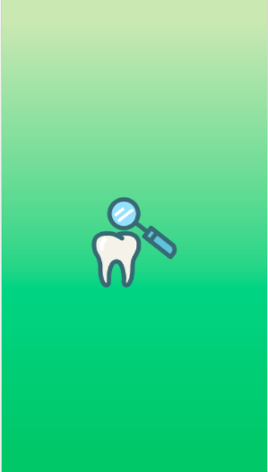
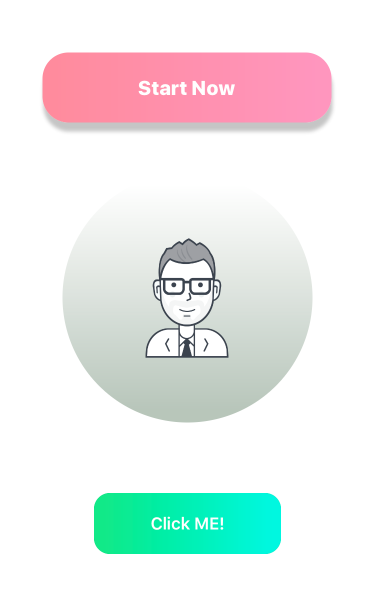
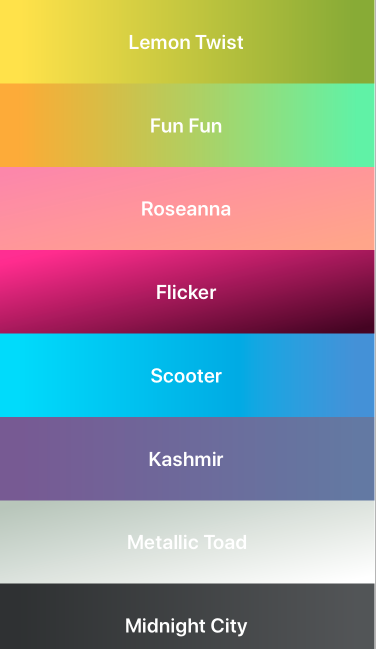
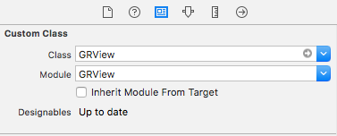
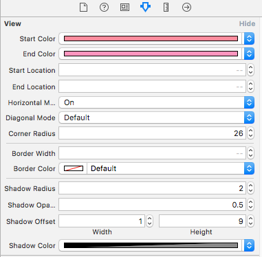

# GRView
UIView and other UIKit elements with a gradient and other customizable properties (gradient,shadow color,corner raduis...etc.)
GRView exposes many properties you can modify to customize your view or button to add gradient layer ,shadow color ,corner raduis , ... etc. GRView Classes is a @IBDesignable class so that it's rendered in your storyboard, and all its properties are @IBInspectable so that you can customize your gradient inside the storyboard in the attributes inspector.

  

# Requirements

GRView is written in Swift 4. iOS 8.0+ Required

# Pod Installation

CocoaPods is the preferred way to install this library. Add this command to your Podfile:

pod 'GRView'

# Direct Installation

Download .zip file and extract it. There you will find the GradientView folder, just copy and it to your respective project.

# Usage

# Storyboard/Xib

while assigning GRView to UIView / other UIKit element on StoryBoard/Xib don't forget to select module
(if downloaded by pod)

 

# Programmatically

```swift
let grView = GRView(frame: view.bounds)
grView.startColor = UIColor(red: 0.7, green: 1.0, blue: 0.7, alpha: 1.0)
grView.endColor = UIColor(red: 0.1, green: 1.0, blue: 0.7, alpha: 1.0)
view.insertSubview(grView, at: 0)
        
```     
# To-do

 - Add like-instagram animation 
 - Allow more than two colors to create gradients.
 - Add more UIKit elements with gradient and properties.
 - Add blur effect.


# Author

Ahmed Komsan, ahmedkomsan0@gmail.com
If you found any problem please create issue or pull request to help me improve this open source project.
also you can suggest featuires/attributes to add , am listening :)


# License

GRView is available under the MIT license. See the LICENSE file for more info.
